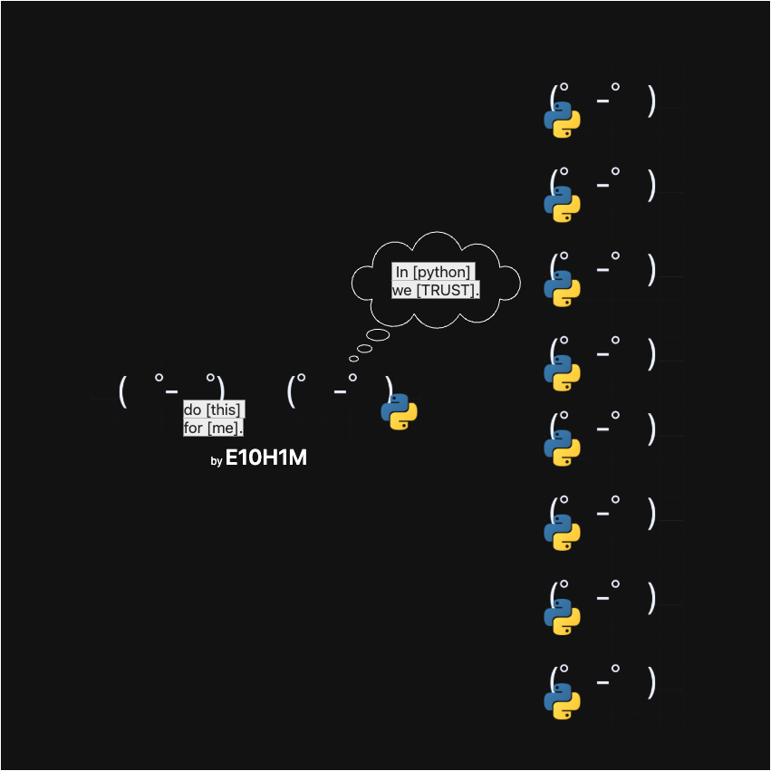

# orch3strator

This repo is heavily in development.
Currently, the worker system for  is being rewritten on this extension friendly architecture. 
For questions please contact me over X, at:  
[https://x.com/c0nsumption_](https://x.com/c0nsumption_)

### \[projects built on orch3strator\]
  

### \[SUPPORTS\]

## The extension system is built to work as a core part of the orch3strator allowing for adatability to different needs and different situations while facilitating rapid development.

# LAUNCHING VERY VERY SOON.   MORE UPDATES TOMORROW.   CHECK ISSUES IN c0nsume-qwen   AND HERE. 